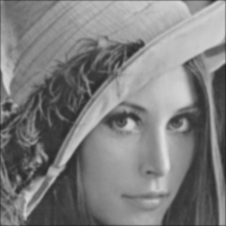
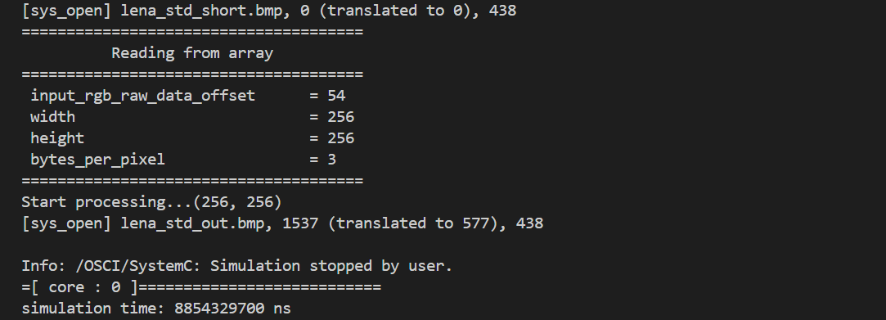

## **EE6470_ESL_HW4**
### <span style="font-family: '標楷體'; font-weight: lighter;">112062707 廖哲緯</span> 
---
1   Prerequisites<br>
- Lab 8 RISCV-VP Platform
## **Problems**
### Requirment
Cross-compile Gaussian Blur Filter to RISC-V VP platform<br>
+ In this homework, please port the Gaussian Blur Filter module to the "basic-acc" platform in Lab 8. You may simply replace the sobel-filter module in the platform. Please also port your test bench as a RISC-V software.
+ Please add the latency of the Gaussian Blur Filter module from HLS.
### Compile and Execute
```powershell
let the path under "*/ee6470/riscv-vp/"
$ cd $EE6470
$ cd riscv-vp/vp/build
$ cmake ..
$ make install
(ref Lab8)
$ cd $EE6470
$ cd riscv-vp/sw/basic-sobel
$ make
$ make sim
```
### Implementation
riscv-vp/vp/scr/platform/basic-acc/filter_def.h<br>
add the latency of the Gaussian Blur Filter module from HLS "20"
```h
#define CLOCK_PERIOD 20
// Gaussian Blur mask parameters
const int MASK_N = 1;
const int MASK_X = 5;
const int MASK_Y = 5;

const double mask[MASK_N][MASK_X][MASK_Y] = {{{1,  4,  7,  4, 1},
                                              {4, 16, 26, 16, 4},
                                              {7, 26, 41, 26, 7},
                                              {4, 16, 26, 16, 4},
                                              {1,  4,  7,  4, 1}}};
```

riscv-vp/sw/basic-sobel/main.cpp<br>
Fixed the problems that the out.bmp turn 90 degrees clockwise.<br>
Let the result as grayscale.
```cpp
            buffer[0] = *(source_bitmap + bytes_per_pixel * ((i + v) * width + (j + u)) + 2);
            buffer[1] = *(source_bitmap + bytes_per_pixel * ((i + v) * width + (j + u)) + 1);
            buffer[2] = *(source_bitmap + bytes_per_pixel * ((i + v) * width + (j + u)) + 0);
            buffer[3] = 0;

            *(target_bitmap + bytes_per_pixel * (width * i + j) + 2) = total;
            *(target_bitmap + bytes_per_pixel * (width * i + j) + 1) = total;
            *(target_bitmap + bytes_per_pixel * (width * i + j) + 0) = total;
```
### Result
Use image "lena_std_short.bmp" as input
+ **Input image** 


+ **Output image** 


- **Simulation time** <br>
The simulation time is 8854329700 ns


